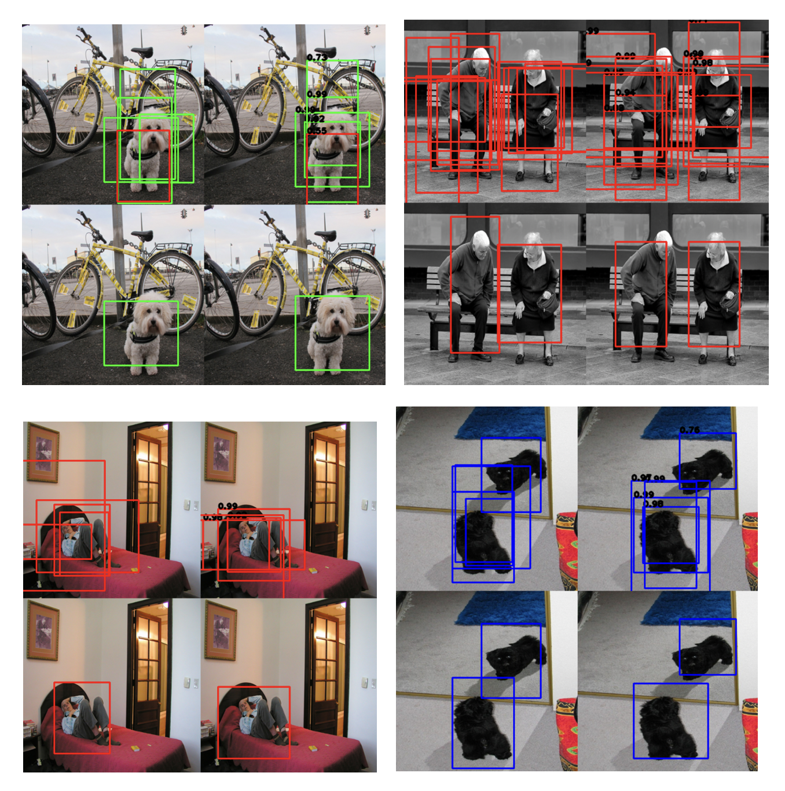

# SSD-Single-Shot-MultiBox-Detector
An object detection network for 2D images. Please refer the paper for details: https://arxiv.org/pdf/1512.02325.pdf.

Data used is a subset of the ImageNet dataset.

Below is a sample output of the trained model, after non-maximum suppression:

